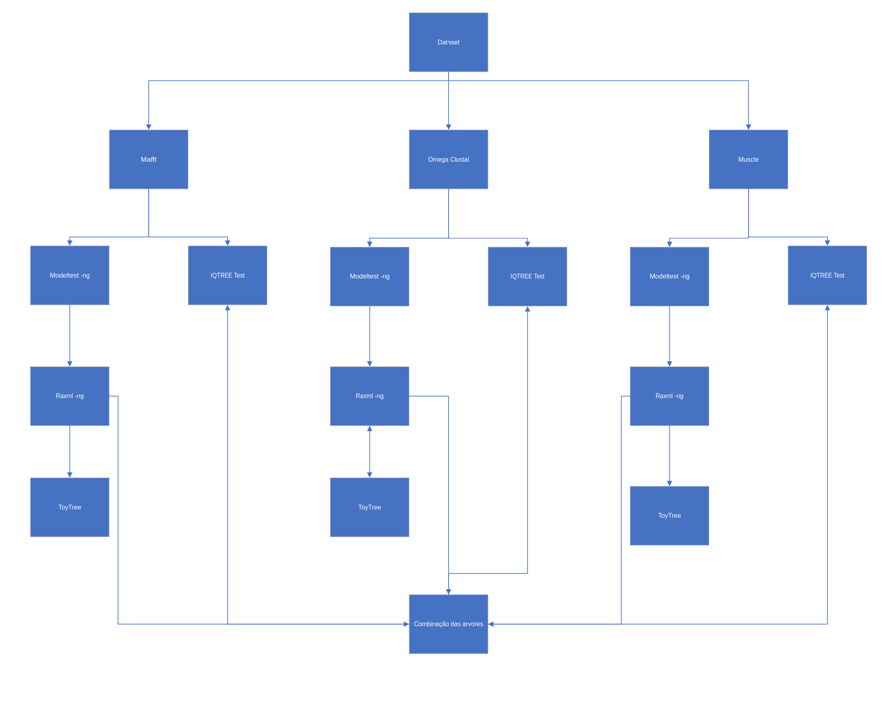

# Comparison of alignment software 

## Description
This tool, developed within the scope of Laboratório de Bioinformática, aims to compare alignment software (MAFFT, Clustal, and Muscle) through p-SH and p-AU tests using IQTree.



## Requisites
* At least one FASTA file in the folder dataset;
* Docker;
* Docker Desktop (Opcional)
* Acess to internet (Only when installing the app)

## Installation
### Download and Extract Project from GitLab
```bash
# Download the project from GitLab
wget https://gitlab.com/laboratorio-de-bioinformatica-2023-2024/sorting-hat/-/archive/main/sorting-hat-main.zip

# Unzip the folder
unzip sorting-hat-main.zip

# Navigate to the Snakemake directory
cd sorting-hat-main
```
### Alternatively, Pull Docker Image from Docker Hub 

```bash
# Pull the Docker image from Docker Hub
docker pull rendrick27/snakemake
```

## Usage
If you haven't pulled the image from Docker Hub, execute the following commands inside the sorting-hat-main folder:
```bash
docker build -t {image_name} .

docker run -it --name {container_name} {image_name} /bin/bash
```

Then, run the following command:
```bash
snakemake --use-conda all --cores all
```
### Saving Results
To save files from the Docker container, use the following commands:
```bash
# Identify Containers
docker ps -a

# Stop Containers
docker stop <container_id>

# Export container files to desktop
docker export <container_id> > ~/Desktop/container_<container_name>.tar
```
Alternatively, you can use Docker Desktop to save files on your desktop by navigating to Docker Desktop > Containers > Actions > View Files. Select the files you want and click "Save".

### Settings
You may adjust settings in the Snakemake command, such as threads and bootstraps, but remember that using more threads may cause more issues.

## Credits
<p> <a href= "https://github.com/Rendrick27"> Rendrick Carreira - 201901365 </a> </p>

## License
MIT License